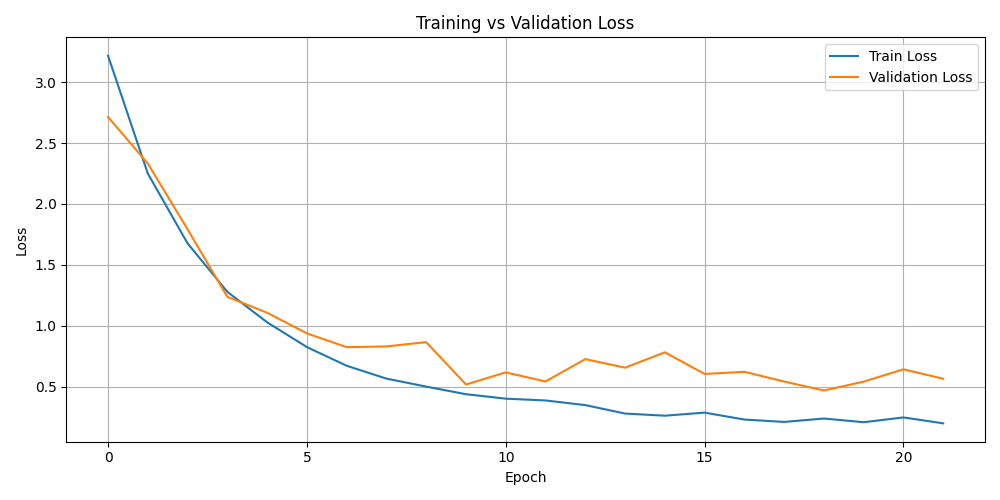
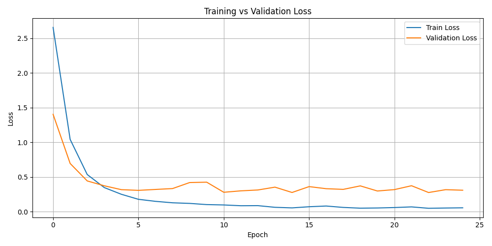
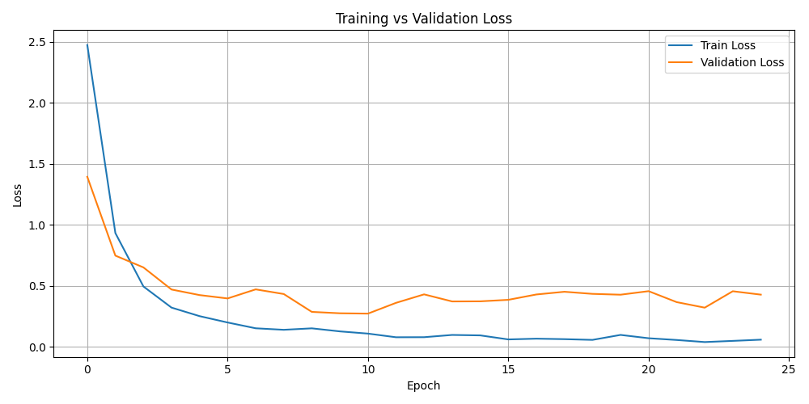

# Dataset overview
This project is using [US license plates image classification dataset](https://www.kaggle.com/datasets/gpiosenka/us-license-plates-image-classification/data) 
which contains clean and labeled images 
of license plates from all 50 U.S. states, District of Columbia and several U.S. territories.

**Total samples**: 8,721 images

**Total classes**: 56 (balanced across all states and regions)

**Format**: JPG images with CSV metadata

Each image is associated with a record in the provided CSV file which includes the following:

| Column     | Description                                          |
|------------|------------------------------------------------------|
| `class id` | Integer identifier (0–55) for each class             |
| `filepaths`| Relative path to the license plate image             |
| `labels`   | Text label (e.g., `"TEXAS"`, `"HAWAI"`, `"ARIZONA"`) |
| `data set` | Data split assignment: `train`, `valid`, or `test`   |

## Dataset splitting
The dataset is pre-divided into training, validation and test sets. The distribution is stratified to maintain 
equal class representation in each set.

| Split       | Percentage |
|-------------|------------|
| Train       | ~94%       |
| Validation  | ~3%        |
| Test        | ~3%        |

Each split contains samples from all 56 classes.

## Data inspection and cleaning
Before model training, dataset was checked for consistency and cleanless:

| Check                            | Result          |
|----------------------------------|-----------------|
| Missing labels or filepaths      | None            |
| Corrupted or unreadable images   | None            |
| Duplicate records                | None            |
| NA rows                          | None            |
| Class imbalance                  | None (balanced) |

No images or labels required removal or imputation. The dataset is clean and ready for modeling.

## Preprocessing pipeline
All images were preprocessed to ensure consistent size and normalization:

### Resize
Every image was resized to 224 × 128 pixels, maintaining consistent dimensions for model input.

### Augmentation
Data augmentation techniques were applied to improve model robustness:

| Transformation                | Description                                                       |
|-------------------------------|-------------------------------------------------------------------|
| `Resize((224, 128))`          | Scales all images to a fixed input shape required by the model    |
| `RandomHorizontalFlip()`      | Flips images horizontally with 50% probability                    |
| `RandomRotation(10)`          | Randomly rotates images by +/-10 degrees                          |
| `ColorJitter(0.2, 0.2)`       | Randomly alters brightness and contrast by up to 20%              |
| `ToTensor()`                  | Converts PIL images to PyTorch tensors                            |
| `Normalize([0.5]*3, [0.5]*3)` | Normalizes pixel values to the range [-1, 1] for each RGB channel |

These augmentations simulate real-world variations in lighting, orientation and appearance to reduce overfitting
and make the model more robust to unseen data.

### Normalization
All image tensors were normalized to the `[-1, 1]` range using:

```python
transforms.Normalize(mean=[0.5, 0.5, 0.5], std=[0.5, 0.5, 0.5])
```
# Model architecture and training report
In this project we implemented a deep learning-based image classifier. The model classifies U.S. license plates 
into one of 56 classes (50 states, D.C. and territories). The goal was to build a robust classifier that performs 
well across real-world variations in plate design, orientation and lighting.

### Model architecture
The final model architecture is based on ResNet50, a pre-trained convolutional neural network (CNN) known 
for its strong performance on image classification tasks. The pretrained ResNet50 backbone was modified 
using transfer learning:

```python
def build_model(num_classes, dropout=0.3):
    model = models.resnet50(pretrained=True)
    in_features = model.fc.in_features
    model.fc = nn.Sequential(
        nn.Linear(in_features, 512),
        nn.ReLU(),
        nn.Dropout(dropout),
        nn.Linear(512, num_classes)
    )
    return model
```

### Transfer learning
The ResNet50 base was pretrained on ImageNet.

We replaced the final fully connected layer with a custom classifier head:

Linear → ReLU → Dropout → Linear

This allowed the model to learn license plate-specific features while leveraging pretrained feature extraction.

### Training time and setup
The models were trained for 25 epochs using a single T4 GPU on Google Colab. Training times varied slightly 
by architecture:

- **DenseNet121**: ~32 minutes  
- **ResNet50**: ~22 minutes  
- **EfficientNet-B0**: ~22 minutes  

Each model was trained using the following configuration:

```python
model = build_model(num_classes).to(DEVICE)
criterion = nn.CrossEntropyLoss()
optimizer = torch.optim.Adam(model.parameters(), lr=0.0005)
```

Loss function: CrossEntropyLoss - suitable for multi-class classification.
Optimizer: Adam with a learning rate of 0.0005 - chosen because of its efficiency.
Batch size: 32 - a common choice balancing memory and convergence speed.
Data augmentation was applied to improve generalization.

Despite DenseNet's strong feature reuse, it required more computation per forward pass, leading to a 
longer training time compared to ResNet50 and EfficientNet-B0. EfficientNet delivered faster and more stable 
training thanks to its lightweight design and fewer parameters.

Trainable parameter counts:

- **EfficientNet-B0**: `4,079,284` parameters  
- **DenseNet121**: `7,011,256` parameters  
- **ResNet50**: `24,585,848` parameters

# Model comparison
Three deep learning models were trained and evaluated for license plate classification:

- **ResNet50** (baseline)
- **EfficientNet-B0**
- **DenseNet121**

## Loss curve comparison
Each model's training and validation loss was tracked for 25 epochs:

| Model       | Training loss        | Validation loss    | Overfitting |
|-------------|----------------------|--------------------|-------------|
| ResNet50    | Slow drop            | Highest overall    | Slight      |
| EfficientNet-B0 | Fast and smooth drop | Lowest overall     | Minimal     |
| DenseNet121 | Fast and smooth drop | Rises after epoch 5 | Noticeable  |

### Insights 
- ResNet50 served as a strong and balanced baseline with good learning behavior
- EfficientNet-B0 showed the best validation performance
- DenseNet121 began overfitting early - validation loss increased despite decreasing training loss

### Visual comparison
Each model’s loss curve is shown below:

#### ResNet50 loss


#### EfficientNet-B0 loss


#### DenseNet121 loss


Based on validation performance and loss trends, EfficientNet-B0 is the most reliable model for this task. 
It generalizes well, trains efficiently and has minimal signs of overfitting.

## Overall performance summary

| Metric     | ResNet50 | EfficientNet-B0 | DenseNet121 |
|------------|----------|------------------|-------------|
| Accuracy   | 0.90     | 0.96             | 0.95        |
| Average F1 | 0.90     | 0.96             | 0.95        |

- EfficientNet-B0 achieved the highest overall accuracy and F1-score making it the best-performing model in this comparison
- DenseNet121 also performed strongly but required more training time due to its dense connectivity structure
- ResNet50 was a solid baseline with decent accuracy and faster training compared to DenseNet

All models were evaluated on the same validation set containing 280 samples equally distributed across 56 classes.
